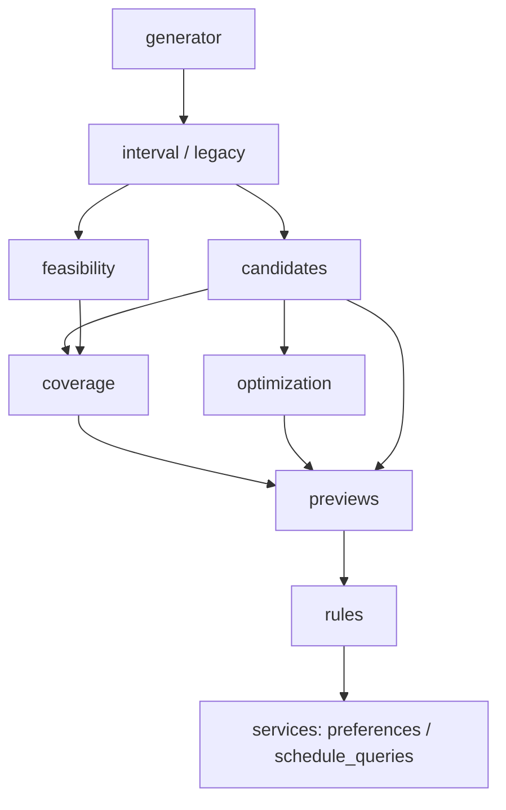

# Архитектура ShiftCare

ShiftCare использует один Python backend для Windows desktop, облачного API и портала сотрудников. Desktop работает с локальной SQLite, а облачный runtime — с PostgreSQL. HTTP-интерфейс остаётся FastAPI, страницы используют Jinja2 и JavaScript из `static/`.

## Точка входа и жизненный цикл

`main.py` создаёт ASGI-приложение через `shiftcare.application.create_app()`. В нём нет обработчиков HTTP или алгоритмов генерации. `launcher.py`, `run_tablet_server.py` и Android bridge используют тот же объект `main.app`.

`create_app()` по умолчанию вызывает `database.init_db()`, создаёт FastAPI, подключает CORS, статические файлы, шаблоны, маршрутизаторы и OpenAPI. Параметр `initialize_database=False` позволяет создать приложение с уже подготовленной базой. Подключение маршрутизаторов происходит один раз для каждого экземпляра приложения.

Lifespan приложения запускает фоновую синхронизацию, когда это разрешено настройками runtime. При завершении он сигнализирует об остановке тому worker, который запустил. Управление единственным worker процесса находится в `shiftcare.services.sync_worker`; импорт модулей сам по себе worker не запускает.

## Где находится код

| Модуль или каталог | Назначение |
| --- | --- |
| `shiftcare/application.py` | Сборка приложения, middleware, маршрутизаторы и lifespan. |
| `shiftcare/routes/` | HTTP-контракты по областям: авторизация, организации, справочники, расписание, генерация, пожелания, обмены, экспорт, backup, обновления. Здесь остаются проверки запроса и часть SQL-операций обработчиков. |
| `shiftcare/services/` | Доступ и роли, авторизация, лицензирование, запросы расписания, cloud bundles, синхронизация, обмены, аудит и вспомогательные операции. Сервисы не импортируют HTTP-маршрутизаторы. |
| `shiftcare/scheduling/` | Правила допустимости смен, кандидаты, покрытие, оценка и оптимизация, interval/legacy генерация, итоговая оркестрация. |
| `shiftcare/config.py` | Константы продукта, значения режимов генерации, лимиты и состояние ограничителей частоты запросов процесса. Версия импортируется из `release_config.py`. |
| `shiftcare/web.py`, `shiftcare/openapi.py` | Пути ресурсов и Jinja2, построение схемы OpenAPI для конкретного приложения. |
| `app_config.py` | Настройки окружения, соединения с БД, cloud и почтой. Это отдельная задача от констант `shiftcare/config.py`. |
| `database.py`, `db_adapter.py` | SQLite/PostgreSQL подключения, инициализация и миграции схемы, SQLite backup/restore, совместимость SQL и строк PostgreSQL. |
| `app_settings_service.py` | Чтение и запись настроек организации и параметров генерации должности. |
| `sync_policy.py` | Представление снимков, сравнение версий, трёхстороннее слияние и сохранение локальных числовых идентификаторов при импорте. |
| `schemas.py`, `row_serializers.py`, `schedule_time.py` | Модели API, преобразование строк и работа с временными интервалами. |
| `templates/`, `static/` | Серверные HTML-шаблоны, JavaScript, CSS, иконки и service worker. |

Модули верхнего уровня сохранены там, где ими пользуются и приложение, и отдельные утилиты. Наличие каталога `services` не означает отдельного ORM или полного слоя репозиториев: SQL по-прежнему явно выполняется через подключения и cursors.

## Направление зависимостей

`main` зависит от `application`, а `application` собирает маршрутизаторы и lifecycle. Маршрутизаторы вызывают сервисы и генератор. Нижние модули не импортируют `main` или `application`, чтобы запрос к бизнес-функции не создавал второе приложение.

Внутри генератора зависимости идут от оркестрации к правилам и вычислениям:

`previews.py` создаёт временные назначения и проверяет их через `rules.py`. Он не выбирает лучшего кандидата и не импортирует `candidates`, `coverage` или `optimization`. Поэтому покрытие и оптимизация могут использовать проверки назначений без обратных импортов в модуль выбора кандидатов.

Генератор использует сервисы чтения расписания и пожеланий. Сервис обменов `services.swaps` использует те же правила `scheduling.rules`. Эти связи проходят между конкретными модулями: сервисы чтения, от которых зависят правила, не импортируют оркестратор генерации или HTTP-маршруты.

## Данные и границы транзакций

Настройки имеют составной ключ `(organization_id, key)`. Вызовы, которые работают с организацией, должны передавать её идентификатор. Для генерации по должности `get_position_app_settings()` определяет организацию по записи должности, если она не указана явно.

Миграции SQLite выполняются в транзакции и закрывают соединение при ошибке. PostgreSQL baseline находится в `docs/postgresql/001_initial_schema.sql`; обновление существующих ограничений выполняется перед применением seed-запросов, которые уже используют новую схему.

Синхронизация сравнивает локальный снимок, сохранённый baseline и актуальное облачное состояние. Cloud-import проверяет ожидаемую версию под блокировкой. При конфликте сервис возвращает ошибку вместо безусловной перезаписи. Worker освобождает транзакцию перед сетевыми запросами и повторно проверяет локальные изменения после ответа облака.

Обычные recovery `.db` — полные локальные снимки. Переносимые `.schedulebackup` дополнительно содержат metadata и очищаются от сессий и токенов; после восстановления требуется новый вход. Для копирования используется SQLite backup API, поэтому учитываются committed WAL-страницы. Restore дожидается завершения управляемых подключений, блокирует новые, сохраняет recovery-снимок и возвращает прежнюю базу при ошибке миграции.

## Как добавлять изменения

- Новый HTTP endpoint добавляется в соответствующий `routes`-модуль; новый маршрутизатор явно подключается в `application.py`.
- Общая бизнес-операция размещается в сервисе или модуле генератора, который не импортирует роутер. Функции вызываются через модуль, например `services_memberships.get_allowed_department_ids(...)`.
- Константы продукта импортируются как `app_constants`, чтобы локальный объект конфигурации `config` не перекрывал импорт.
- Новое поле схемы требует согласованного SQLite/PostgreSQL изменения и увеличения версии схемы. Изменения поведения проверяются на временных данных, а не на рабочем `schedule_app.db`.
- Тесты импортируют реальный модуль функции. `main.py` не служит совместимым пространством имён для всех внутренних функций приложения.
